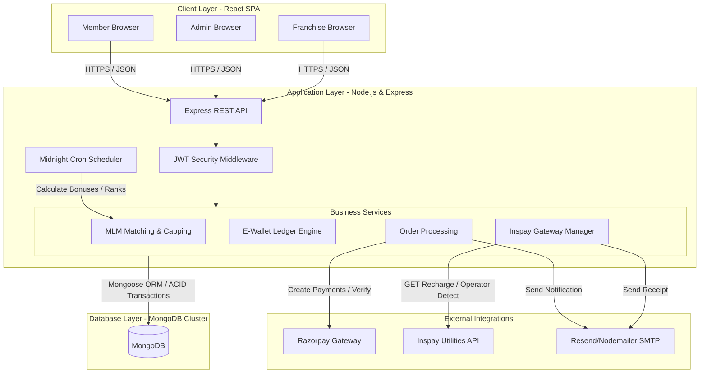
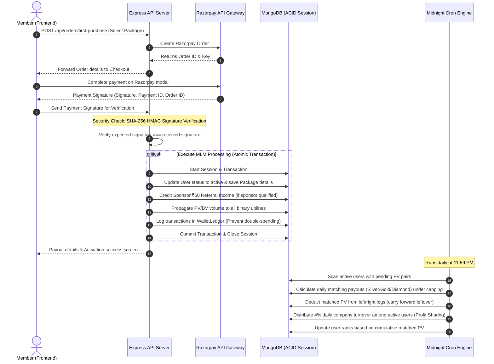
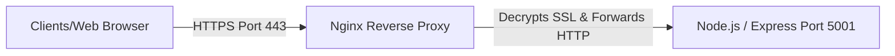
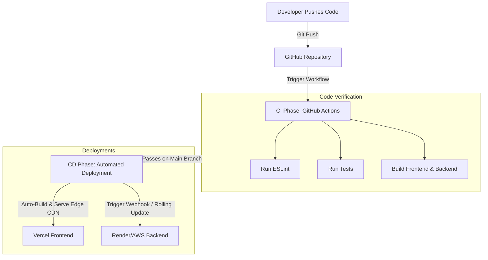

# Sanyukt Parivaar & Rich Life Pvt. Ltd. — Full Stack Project Explanation & Interview Guide

This document provides a comprehensive technical and business analysis of the project. It is designed to prepare you for your software engineering interview by explaining **what the project is, what technologies and libraries are used, how the database is structured, how the core MLM logic is calculated, and what advanced architectural patterns are implemented**.

---

## 1. Project Overview & Business Domain

**Sanyukt Parivaar & Rich Life Pvt. Ltd.** is a full-stack e-commerce, utility recharge, and Multi-Level Marketing (MLM) platform. The application provides two main user experiences:
1. **A public-facing portal** containing an e-commerce shop, utility recharge panel, donation page, gallery, events, company information, and a signup/login interface.
2. **A secured, role-based Member Dashboard** where registered direct sellers manage their downline network, view real-time commission statements, transfer wallet balances, upgrade packages, download membership collateral, and request payouts.
3. **An Administrative Portal** where administrators manage users, approve KYC requests, review wallet top-up transactions, process withdrawal requests, manage shop products, handle support tickets, and trigger MLM daily closings.
4. **A Franchise Panel** allowing authorized franchise centers to manage local product stocks and bill local members.

---

## 2. Core Features & Business Logic

### A. Dual-Income Compensation Engine (MLM Plan)
The compensation model is the heart of the platform. It features two distinct income systems:

#### i. First Purchase Plan (Binary Plan)
*   **Activation Packages**: When a member signs up, they must purchase a "First Purchase" package to activate their position:
    *   **Silver Package (₹599)**: Yields **0.25 PV**, **250 BV**, and has a daily capping of **₹2,000**.
    *   **Gold Package (₹1299)**: Yields **0.50 PV**, **500 BV**, and has a daily capping of **₹4,000**.
    *   **Diamond Package (₹2699)**: Yields **1.00 PV**, **1000 BV**, and has a daily capping of **₹10,000**.
*   **Direct Sponsor Income**: Pays **₹50** referral bonus directly to the sponsor's E-Wallet.
    *   *Qualification Rule*: The sponsor must be active (`activeStatus = true`) and hold at least **0.50 PV** (Gold/Diamond package active).
*   **Binary Matching Bonus (Pair Match)**: The system matches left-leg volume against right-leg volume.
    *   Matching is performed based on PV (Point Volume).
    *   **Silver Match**: 0.25 PV pair matches $\rightarrow$ Pays **₹100**.
    *   **Gold Match**: 0.50 PV pair matches $\rightarrow$ Pays **₹200**.
    *   **Diamond Match**: 1.00 PV pair matches $\rightarrow$ Pays **₹400**.
    *   *Carry Forward*: Leftover team volume that is unmatched carries forward indefinitely.
    *   *Capping*: Checked dynamically against the daily capping limit corresponding to the user's active package (Silver: ₹2000, Gold: ₹4000, Diamond: ₹10000). Any earnings beyond this limit are capped.
*   **First Purchase Generation Income**: Distributes a percentage of the Business Volume (BV) up to **20 generations** of sponsors:
    *   Level 1: **5%** | Level 2: **4%** | Level 3: **3%** | Level 4: **2%**
    *   Level 5-6: **1%** | Level 7-10: **0.5%** | Level 11-12: **0.4%** | Level 13-18: **0.3%** | Level 19-20: **0.2%**

#### ii. Repurchase Plan (E-Commerce Plan)
*   When active members buy general e-commerce products from the store, it accumulates **Repurchase BV**.
*   This volume does not feed the binary matching, but instead distributes **Repurchase Generation Commissions** up to **20 levels** of active sponsors based on the following rates:
    *   Level 1: **10%** | Level 2: **8%** | Level 3: **5%** | Level 4: **3%** | Level 5: **2%**
    *   Level 6-10: **1%** each | Level 11-20: **0.5%** each.
*   Repurchase commissions are deposited into the **Generation Wallet** and are subject to the daily capping limit of the user's active package.

---

### B. Daily MLM Automations (Cron Jobs)
An automated background scheduler runs daily at **11:59 PM** to execute three critical calculations:
1.  **Daily Binary Matching Bonus**: Scans all active users, evaluates unmatched left vs right PV, calculates payouts under package cappings, updates user records, and adds ledger entries.
2.  **Profit Sharing Pool**: Calculates 4% of the company's daily turnover (from all orders placed that day) and distributes it proportionally among active users based on their personal PV weight.
3.  **Automatic Rank Upgrades**: Re-evaluates each member's total cumulative matched PV against the 15-tier rank system (Bronze $\rightarrow$ MD) and rewards them:
    *   *Bronze* (5 Matched PV): Bronze Badge + Company Catalog.
    *   *Silver* (25 Matched PV): ₹1200 cash reward.
    *   *Gold* (50 Matched PV): ₹2500 cash reward.
    *   *Diamond* (30,000 Matched PV): ₹10,00,000 cash reward.
    *   ... up to *MD* (1,500,000 Matched PV): ₹5 Crore cash reward.

---

### C. Live Utility Recharge Gateway
Members can recharge mobile connections and DTH boxes using their e-wallet balance or Razorpay online payments.
*   **Third-party Provider**: Integrated with the **Inspay / EkycHub** API (`connect.inspay.in/v3/recharge/api`).
*   **Auto-Detection**: Submits mobile numbers via GET requests to fetch live operators and circle codes (e.g. Jio, Airtel, VI, BSNL, with circle codes mapped automatically).
*   **Plans Fetcher**: Retrieves live plans dynamically categorized by packages (top-up, internet, unlimited) with a fallback system: if plans return empty, the system queries Operator/Circle detection and re-attempts the plan request.
*   **Recharge Reward**: Credits **5% cashback** of the recharge value directly back to the member's wallet balance upon success.

---

### D. Digital Membership Center & Collateral
*   **Membership ID Card**: Generates a custom-themed ID card including the user's member ID, sponsor ID, mobile, state, profile picture, join date, and active status. Downloadable as a PDF using client-side HTML canvas rendering (`html2pdf.js`).
*   **Official Welcome Letter**: Displays a formal letter of appointment. Uses CSS `@media print` rules, allowing clean browser printing and A4 PDF formatting.

---

### E. Secured Wallet & Ledger Engine
*   **Dual-Wallet Architecture**: Users have an **E-Wallet** (for binary matching, direct referrals, recharge cashbacks) and a **Generation Wallet** (for repurchase commissions). A separate **Product Wallet** is used specifically for shopping balances.
*   **Anti-Double Spend Safeguards**: Every transaction is logged inside a unified ledger (`WalletLedger` and `Transaction` schemas) tracking the balance before, balance after, reference IDs, transaction types (debit/credit), and meta descriptors.
*   **Withdrawal Requests**: Members can request bank transfers. The system deducts TDS (5%) and Admin Charges (10%) automatically and puts the request in pending status for Admin approval.

---

## 3. Technology Stack & Key Libraries

### Frontend (Client-side)
*   **React 19.2.0**: User interface framework.
*   **Vite 7.3.1**: Development environment and bundler.
*   **React Router DOM 7.13.0**: Dynamic client-side routing, query parameter mapping, and dashboard layouts.
*   **Tailwind CSS 4.2.0**: CSS utility framework.
*   **Material-UI (MUI) 7.3.8 & Emotion**: Pre-designed components, grid systems, tables, icons, and print styling controls.
*   **Axios 1.13.5**: HTTP client with global API interceptors to attach JWT headers.
*   **html2pdf.js (jspdf / html2canvas)**: Renders off-screen HTML snippets with inline styling directly to PDF for downloading ID cards.
*   **Chart.js & react-chartjs-2**: Renders dashboard summary charts (income growth, team statistics).
*   **Framer Motion 12.34.3**: Micro-animations and page transition effects.
*   **React Hot Toast**: Beautiful top-center notifications.

### Backend (Server-side)
*   **Node.js (CommonJS modules)**: JS runtime.
*   **Express.js 5.2.1**: REST API router.
*   **MongoDB & Mongoose 9.2.1**: Database schema modelling, aggregations, and query optimizations.
*   **JSON Web Tokens (JWT)**: Secure user sessions.
*   **bcryptjs**: Hashing user passwords securely using salt rounds.
*   **Razorpay SDK 2.9.6**: Handles online checkout order creation, signature SHA-256 HMAC verification, and captured webhooks.
*   **Resend SDK & Nodemailer**: Direct email generation for OTPs, order placements, and recharge statements.
*   **Multer**: Handles file and image uploads for profiles, KYC documents, and deposit receipts.

---

## 4. Architecture & Database Design

### Core Database Models (Mongoose Schemas)

#### 1. User Model (`User.js`)
Stores member profile information, MLM references, and running balances:
```javascript
const userSchema = new mongoose.Schema({
    userName: { type: String, required: true },
    memberId: { type: String, unique: true }, // Format: SPRLXXXX (Uppercase)
    sponsorId: { type: String, required: true }, // The sponsor's memberId
    parentId: { type: mongoose.Schema.Types.ObjectId, ref: 'User' }, // Immediate binary parent
    position: { type: String, enum: ['Left', 'Right'] }, // Left or Right leg placement
    left: { type: mongoose.Schema.Types.ObjectId, ref: 'User' }, // Left child node ID
    right: { type: mongoose.Schema.Types.ObjectId, ref: 'User' }, // Right child node ID
    activeStatus: { type: Boolean, default: false }, // Activated after first purchase
    packageType: { type: String, default: 'none' }, // silver, gold, diamond, none
    walletBalance: { type: Number, default: 0 }, // E-wallet balance
    dailyCapping: { type: Number, default: 0 },
    pv: { type: Number, default: 0 }, // Personal PV
    bv: { type: Number, default: 0 }, // Personal BV
    totalLeftPV: { type: Number, default: 0 }, // Cumulative volume from left leg
    totalRightPV: { type: Number, default: 0 }, // Cumulative volume from right leg
    usedLeftPV: { type: Number, default: 0 }, // PV already matched on Left
    usedRightPV: { type: Number, default: 0 }, // PV already matched on Right
    leftTeamPV: { type: Number, default: 0 }, 
    rightTeamPV: { type: Number, default: 0 },
    matchedPV: { type: Number, default: 0 }, // Total PV matched in pairs
    rank: { type: String, default: 'Member' },
    kycStatus: { type: String, enum: ['Not Applied', 'Pending', 'Approved', 'Rejected'], default: 'Not Applied' }
});
```

#### 2. Binary Tree Model (`BinaryTree.js`)
Maintains flat relational snapshots of team sizes and point volumes for fast API response times without executing deep recursive database joins:
*   `userId` $\rightarrow$ Owner of the tree node.
*   `totalLeft` / `totalRight` $\rightarrow$ Count of all descendants in left/right legs.
*   `leftPV` / `rightPV` $\rightarrow$ Total point volumes in left/right legs.

#### 3. Wallet Ledger Model (`WalletLedger.js`)
Strict double-entry accounting schema to prevent fraud:
*   `userId`, `walletType` (`e-wallet`, `generation-wallet`, `product-wallet`).
*   `txType` (`credit`, `debit`).
*   `amount`, `balanceBefore`, `balanceAfter`.
*   `referenceId` $\rightarrow$ Unique compound string to enforce transactional idempotency.
*   `sourceType` (e.g. `Direct`, `SilverMatching`, `RechargeReward`, `Withdrawal`).

---

## 5. High-Impact Technical Interview Talking Points

During your interview, highlight these **advanced implementation details** to show you have deep engineering knowledge:

### Talk 1: Queue-Based Downline Counting (Avoiding Stack Overflow)
**The Problem**: In a deep binary tree, recursively counting left and right descendants (`child -> count(left) + count(right)`) can lead to stack overflows or slow responses.
**Your Solution**: You implemented an iterative **Breadth-First Search (BFS)** algorithm using a queue:
```javascript
exports.countDownline = async (rootId) => {
    if (!rootId) return 0;
    let count = 0;
    const queue = [rootId];
    while (queue.length > 0) {
        const currentId = queue.shift();
        const current = await User.findById(currentId);
        if (current) {
            count += 1;
            if (current.left) queue.push(current.left);
            if (current.right) queue.push(current.right);
        }
    }
    return count - 1; // Subtract 1 if you want to exclude the root node itself
};
```
*   *Why it's impressive*: Shows you understand memory management, data structures, and the pitfalls of deep recursion in databases.

### Talk 2: Atomic MongoDB Transactions (`session.withTransaction`)
**The Problem**: When a member purchases a product to activate their account, multiple operations must happen at the same time:
1. Deduct wallet balance (or verify Razorpay success).
2. Mark order as paid.
3. Activate user status and package capping.
4. Propagate binary volume (PV/BV) to all ancestors.
5. Trigger binary matches and payouts.
If one step fails (e.g., database connection drops halfway), the database will be left in an inconsistent state (e.g., money is deducted, but order is pending, or points are not added).
**Your Solution**: You wrapped the entire sequence in an **atomic MongoDB Session transaction** (`withTransaction`):
```javascript
const session = await mongoose.startSession();
try {
    await session.withTransaction(async () => {
        // All DB reads and writes use .session(session)
        const user = await User.findById(userId).session(session);
        user.activeStatus = true;
        await user.save({ session });
        
        await propagateBinaryVolume({ sourceUserId: user._id, pv, bv, session });
        await runMatchingForUser({ userId: uplineId, session });
    });
} finally {
    await session.endSession();
}
```
*   *Why it's impressive*: Demonstrates your understanding of consistency, transaction boundaries, and ACID compliance in enterprise software development.

### Talk 3: Carry-Forward and Daily Capping Pair Matching Logic
**The Problem**: How to efficiently calculate binary matching payouts when members can sign up at any time, while ensuring carry-forward points are preserved and daily limits are not exceeded.
**Your Solution**:
1. You tracked cumulative metrics (`totalLeftPV` vs `totalRightPV`) and matched metrics (`usedLeftPV` vs `usedRightPV`).
2. Current unmatched points are resolved dynamically: `leftRemaining = totalLeftPV - usedLeftPV`.
3. The system converts PVs into integer units (units of 0.25 PV) to calculate the matching rules (Silver: 1 unit, Gold: 2 units, Diamond: 4 units).
4. Daily matching payouts check the daily package caps (`remainingCap = cappingLimit - todayIncome`).
5. Only matching amounts up to `remainingCap` are paid out. The matched volume is updated in `usedLeftPV` / `usedRightPV`, while remaining unmatched volumes carry forward automatically.
*   *Why it's impressive*: Proves you can convert complex business requirements into clear mathematical algorithms.

### Talk 4: Razorpay Security Signature Verification
**The Problem**: Preventing malicious API manipulation where a user inspects network traffic and hits the `/api/payments/verify` endpoint with fake data to gain product balance without paying.
**Your Solution**: Secure HMAC-SHA256 signature verification. You combined the `razorpay_order_id` and `razorpay_payment_id` with the secret key (`RAZORPAY_KEY_SECRET`), hashed it using Crypto, and compared the output against the signature sent by the Razorpay frontend:
```javascript
const body = razorpay_order_id + "|" + razorpay_payment_id;
const expectedSignature = crypto
    .createHmac("sha256", process.env.RAZORPAY_KEY_SECRET)
    .update(body)
    .digest("hex");
const isAuthentic = expectedSignature === razorpay_signature;
```
*   *Why it's impressive*: Shows you prioritize cybersecurity and secure payment integrations.

### Talk 5: Diagnosing and Simulating Node.js Memory Leaks
**The Problem**: Node.js uses V8 for memory management and Garbage Collection (GC). If references to objects are maintained unintentionally (e.g., inside global arrays or closures), V8 cannot reclaim the memory, leading to an Out of Memory (OOM) crash.
**Your Solution**: You built a dedicated memory diagnostics route (`/api/debug`) to demonstrate this concept live:
1.  **`/api/debug/leak`**: Pushes massive string allocations (10MB per request) into a global array `leakStorage`. Since the array is global, the GC cannot clear it.
2.  **`/api/debug/memory`**: Uses `process.memoryUsage()` to track the `heapUsed` size in real-time, proving the memory footprint is growing uncontrollably.
3.  **`/api/debug/clear-leak`**: Resets the global array (`leakStorage = []`), immediately dropping the references so the GC reclaims the memory on its next cycle.
*   *Why it's impressive*: Most junior developers only understand basic CRUD operations. Understanding heap allocation, garbage collection, and intentional memory retention demonstrates senior-level diagnostic skills.

---

## 6. System Architecture & Design

### A. System Topology (Tiered Architecture)
The application follows a classic **3-Tier Architecture Pattern** (Client, Application, and Database), augmented with third-party service gateways:



### B. Core Data Flow: First Purchase & MLM Activation
This sequence diagram shows how an order is processed, payment verified, points propagated, and payouts calculated in a safe, atomic sequence:



### C. System Design Considerations (Talking Points for Interview)

1.  **Stateless Session Authentication**: Uses JSON Web Tokens (JWT) signed with a server-side `JWT_SECRET`. The token is stored on the client side (in `localStorage`) and sent with every API call inside the `Authorization: Bearer <token>` header, parsed by the `protect` middleware.
2.  **API CORS Restrictions**: The backend configuration has strict CORS origin mapping that rejects requests from unknown domains. In production, it only accepts requests from your verified client domain (or Vercel preview environments).
3.  **Database Availability Middleware**: To prevent server crash states during MongoDB connection lapses, a custom Express middleware checks `mongoose.connection.readyState` and returns a clean `503 Service Unavailable` error instead of letting database reads crash the node thread.
4.  **Database Schema Indexing**: High-read schemas like `User` and `IncomeHistory` have indexes on `memberId`, `sponsorId`, `userId`, and `createdAt` to optimize search performance, keep database query latency low, and ensure smooth paginated loading in the admin panel.
5.  **Clean Separation of Concerns (Service Layer Pattern)**: Business logic is decoupled from HTTP routers. For example, route handlers under `routes/mlmRoutes.js` delegate tasks directly to controllers in `controllers/mlmController.js`, which invoke reusable transactional utilities in `services/matchingService.js` and `services/binaryService.js`.

---

## 7. Scalability & Traffic Capacity (System Performance)

When asked: *"How much traffic can this website support at a time?"*, structure your answer by separating the Frontend, Backend, and Database tiers:

### A. Frontend Tier (Client-side React)
*   **Capacity**: **Practically Unlimited (Millions of users)**.
*   **Detail**: Because the React code is compiled into static HTML, CSS, and JS bundles and deployed on **Vercel's global CDN (Edge Network)**, loading the homepage or navigation routes does not hit your server. Edge nodes serve the pages instantly from locations closest to the user.

### B. Application Tier (Node.js/Express)
*   **Capacity**: **3,000 to 5,000 Active Concurrent Users** on a basic single-core instance (e.g. Render Starter, AWS `t3.medium`).
*   **Detail**:
    *   Node.js utilizes a single-threaded **Event Loop** with non-blocking I/O.
    *   A single Node.js instance can comfortably handle **300 to 500 Requests Per Second (RPS)** for typical read/write JSON API endpoints.
    *   Since a browsing user only triggers an API request occasionally (roughly 1 request every 5–10 seconds), this translates to supporting thousands of active dashboard sessions at any given moment.

### C. Database Tier (MongoDB & Mongoose ORM)
*   **Capacity**: **1,000+ Read/Write Operations Per Second**.
*   **Optimization Details**:
    *   **Database Indexing**: Crucial queries lookup users by `memberId` or `sponsorId`. By indexing these fields, MongoDB executes lookups in $O(\log N)$ time rather than performing collection scans.
    *   **Cursor Pagination**: Admin tables use paginated API queries (handling limit/skip) to keep memory footprints low.
    *   **Caching Static Files**: Static files under `/uploads/` are configured with Express Cache-Control headers (`maxAge: '1d'`), offloading image fetches to the browser's cache.

### D. Scalability Strategy (How to handle 100k+ users)
To scale this project to an enterprise level, you would implement the following modifications:
1.  **Horizontal Scalability**: Deploy multiple backend Node.js server instances in dockerized containers behind an **Nginx Load Balancer** or AWS Application Load Balancer (ALB).
2.  **Redis Cache Layer**: Cache read-heavy and slow queries (like the user profile, wallet ledger stats, or matching tables) in **Redis** with a 5-minute Time-To-Live (TTL) to avoid querying MongoDB repeatedly.
3.  **MongoDB Replica Sets**: Split read/write requests. Write transactions are sent to the MongoDB primary database, while read requests (like order history lists or transaction logs) are handled by replica secondaries.

---

## 8. Production Deployment, SSL Termination, & Security (Nginx)

In production, the application is deployed behind **Nginx**, acting as a reverse proxy. This architecture provides several performance and security advantages:

### A. Nginx Reverse Proxy Flow


### B. Core Functions of Nginx in this Project
1.  **SSL/TLS Termination**:
    *   External clients connect to Nginx over secure HTTPS (`Port 443`). Nginx holds the SSL/TLS certificates (issued by **Let's Encrypt** via **Certbot** for automatic 90-day renewals).
    *   Nginx performs the CPU-heavy cryptographic decryption and forwards the plain HTTP request to the Node.js application running locally on `127.0.0.1:5001`. This offloads SSL processing from the single-threaded Node.js event loop, saving CPU cycles for business logic.
2.  **Static Content Serving & Gzip Compression**:
    *   Nginx is configured to serve static assets (images, stylesheets, client build bundles) directly from the filesystem.
    *   It compresses JSON response payloads using **Gzip** before sending them over the wire, minimizing network latency.
3.  **DDoS Protection & Rate Limiting**:
    *   Configured using Nginx’s `limit_req_zone` to restrict request rates per IP address, preventing brute-force attacks on the `/api/login` and `/api/verify-otp` endpoints.

---

## 9. Continuous Integration & Continuous Deployment (CI/CD)

The project utilizes a modern DevOps workflow to automate code checks and deployments, ensuring high code quality and zero-downtime updates.

### A. The CI/CD Pipeline Workflow


### B. CI/CD Implementation Details
1.  **Continuous Integration (GitHub Actions)**:
    *   On every pull request or push to the `main` and `dev` branches, a GitHub Actions workflow executes inside a clean Docker container (`ubuntu-latest`).
    *   It checks out the code, installs dependencies for the root, client, and server workspaces (`npm run install-all`), runs syntax checks (`eslint .`), and executes tests.
    *   This prevents broken builds, syntax errors, or regression bugs from reaching production.
2.  **Continuous Deployment (CD) for React Frontend (Vercel)**:
    *   Connected via Git Integration. Once GitHub Actions passes, Vercel automatically pulls the branch, builds the production assets (`npm run build`), and deploys it to Vercel's Edge network with a new deployment URI.
3.  **Continuous Deployment (CD) for Node.js Backend (Render or AWS)**:
    *   **Rolling Deployments**: Configured to deploy using rolling updates (zero-downtime). The platform spins up a new instance of the Node.js container, waits for the health check endpoint `/api/health` to return `200 OK`, and then swaps traffic over before shutting down the old container. This ensures users never see a 404 or connection error during updates.

---

## 10. How to Explain This Project (Elevator Pitch)

*"In my project, **Sanyukt Parivaar**, I built a scalable full-stack E-Commerce, Utility Recharge, and Multi-Level Marketing (MLM) platform. The technology stack consists of React 19 and Tailwind CSS on the frontend, and Node.js with Express and MongoDB/Mongoose on the backend.


What makes this project technically challenging is its core MLM compensation engine. I designed a dual-wallet ledger system that supports carry-forward binary matching payouts, package upgrades, daily capping limits, and 20 levels of sponsor repurchase generation commissions. I automated these computations using daily midnight cron jobs and protected database operations by wrapping MLM propagations in atomic MongoDB transactions.


From a DevOps and infrastructure perspective, the frontend is deployed globally via a CDN, and the backend is deployed behind an **Nginx Reverse Proxy** which handles **SSL Termination** using **Let's Encrypt** certificates to offload cryptography from the Node process. I also implemented a fully automated **CI/CD pipeline using GitHub Actions, Vercel, and Render** to ensure zero-downtime rolling deployments, automated linting, and continuous verification on every git push."*

**All the best for your interview tomorrow! You have built a highly feature-rich, enterprise-grade system—explain these points confidently!**


